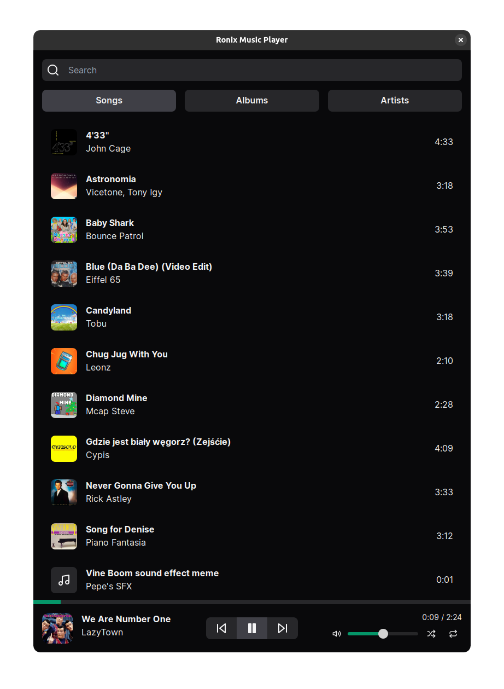

<h1>
  
  Ronix Music Player
</h1>

All linux music players suck, so I am making my own

## Download

Download Ronix player AppImage from the [releases page](https://github.com/ronanru/ronix/releases/).

## Features Roadmap

- [x] Plays music (All traditional music player features)
- [x] Fuzzy search
- [x] Multiple themes
- [ ] Song manager (Ability to edit song tags, delete songs)
- [ ] Song downloader with yt-dlp
- [ ] Publish on flathub, the AUR
- [ ] MacOS, Windows support
